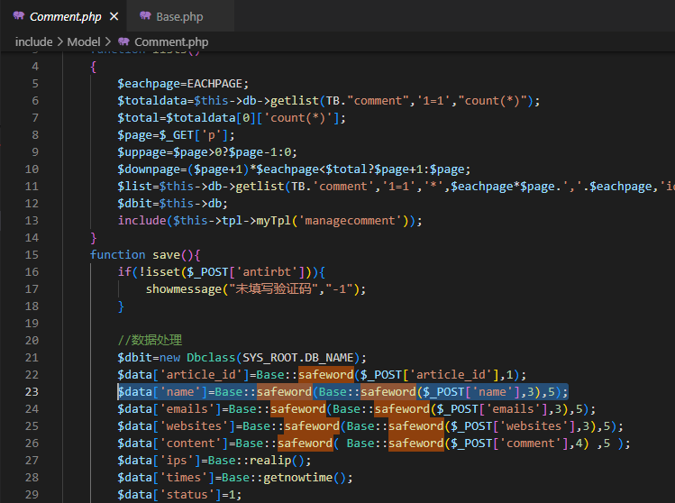
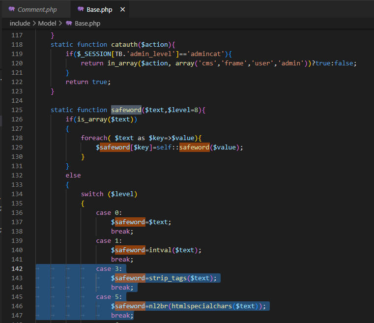
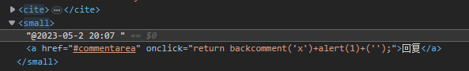
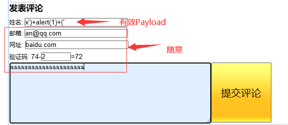
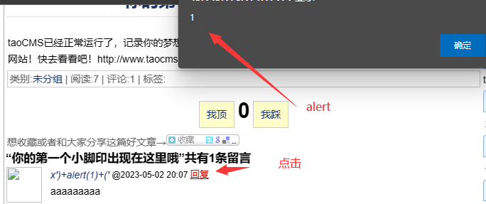

# DOM XSS in taocms
## Code Audit
In `Model/Comment.php`, the `name` is filtered by `safeword` function in `Model/Base.php`, which is not strict enough.


 
In `Model/Base.php`, the `safeword` function is defined as follows:



It means the `name` will be filtered by `strip_tags`, `htmlspecialchars` and `nl2br`. But in fact, it is not strict enough. If the input is inserted into the attribute of html tag, it will be invalid.

As shown in the figure below, the `name` is spliced into the attribute by the front end, resulting in XSS.



## POC
To exploit this vulnerability, we can use the following payload:


The effective payload is as follows:
```
x')+alert+('
```
The `name(姓名)` is the vulnerable point, while other fields are not necessary.

Once the payload is injected, the XSS will be triggered when any user who tries to reply the comment.

